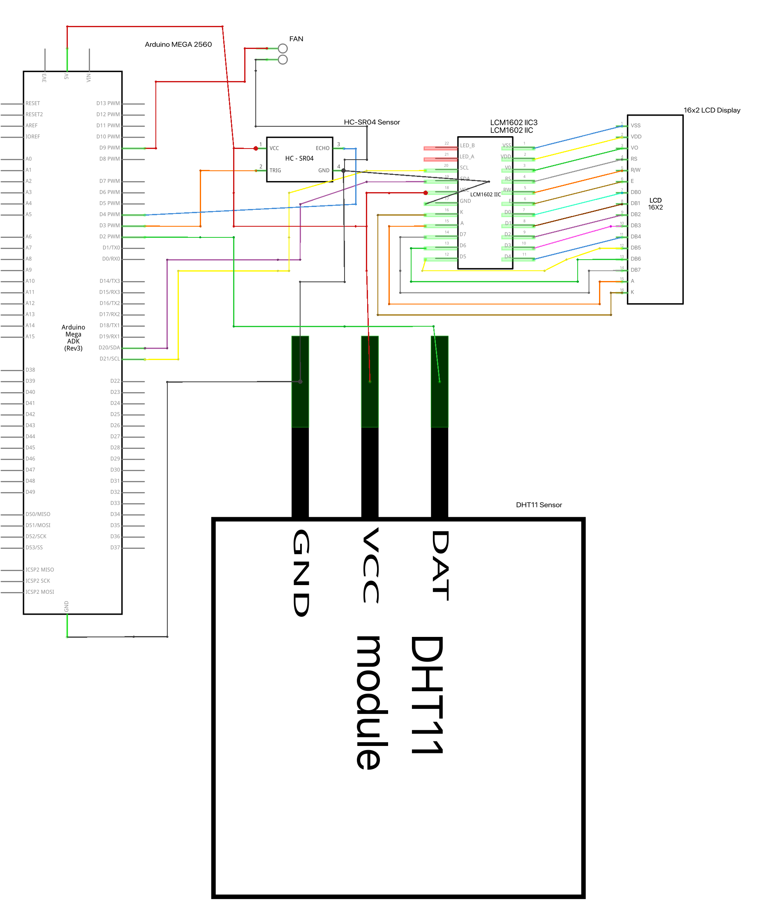
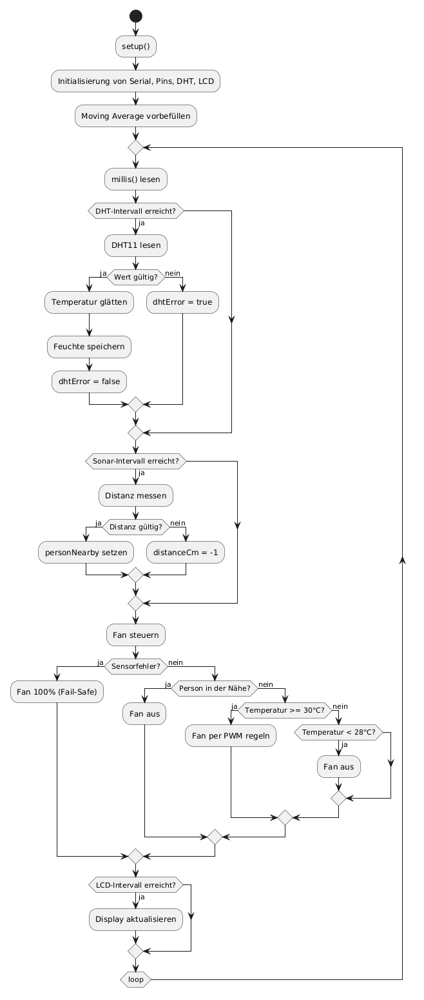

# Serverraumüberwachung mit automatischer Lüftersteuerung

Arduino-Projekt zur Überwachung eines Serverraums: Temperaturmessung, automatische PWM-Lüftersteuerung, Abstandserkennung als Lüfter-Stopp und Statusanzeige auf einem 16x2-I2C-LCD.

Die aktuelle Version enthält zwei gepflegte Sketch-Varianten:

| Sketch | Sensoren | Zusatznutzen |
|---|---|---|
| `serverroom_fan_control-TMP36.ino` | TMP36 + HC-SR04 | schnelle analoge Temperaturmessung |
| `serverroom_fan_control_dht11.ino` | DHT11 + HC-SR04 | Temperatur plus Luftfeuchtigkeit auf dem LCD |

## Funktionen

- Temperaturabhängige Lüfterfreigabe mit Hysterese:
  - Einschalten ab `30.0 °C`
  - Ausschalten unter `28.0 °C`
- PWM-Regelung zwischen `FAN_PWM_MIN = 100` und `FAN_PWM_MAX = 255`
- Lineare PWM-Abbildung des Temperaturbereichs von `20.0 °C` bis `40.0 °C`
- Glättung der Temperaturwerte per gleitendem Mittelwert
  - TMP36: 10 Messwerte
  - DHT11: 5 Messwerte
- Personenerkennung über HC-SR04:
  - unter `50 cm` wird der Lüfter abgeschaltet
  - Messwerte über `500 cm` oder Timeouts werden als ungültig behandelt
- Failsafe bei Sensorfehlern:
  - TMP36-Version: HC-SR04-Fehler setzt den Lüfter auf 100 %
  - DHT11-Version: DHT11- oder HC-SR04-Fehler setzt den Lüfter auf 100 %
- Serielle Debug-Ausgabe mit `9600 Baud`
- Zeitgesteuerte Messintervalle:
  - TMP36: Temperatur alle `500 ms`, Abstand alle `200 ms`, LCD alle `1000 ms`
  - DHT11: Temperatur/Luftfeuchtigkeit alle `2000 ms`, Abstand alle `200 ms`, LCD alle `1000 ms`

## Hardware

- Arduino Mega 2560
- 5-V-Lüfter mit PWM-/Steuereingang oder geeigneter Treiberstufe
- TMP36 **oder** DHT11
- HC-SR04 Ultraschallsensor
- 16x2-I2C-LCD, Standardadresse im Code: `0x27`
- Jumper-Kabel, ggf. Breadboard

> Wichtig: Einen Lüfter nicht direkt über einen Arduino-I/O-Pin mit Strom versorgen. Der Pin `D9` ist in den Sketches als PWM-/Steuersignal vorgesehen. Die Lüfterversorgung muss zur Stromaufnahme des Lüfters passen; bei einem einfachen DC-Lüfter wird eine Treiberstufe, z. B. Transistor oder MOSFET mit Freilaufdiode, benötigt.

## Pinbelegung

### Gemeinsame Anschlüsse

| Komponente | Anschluss | Arduino Mega 2560 |
|---|---:|---:|
| HC-SR04 | TRIG | D3 |
| HC-SR04 | ECHO | D4 |
| HC-SR04 | VCC | 5V |
| HC-SR04 | GND | GND |
| Lüfter | PWM/Steuersignal | D9 |
| I2C-LCD | SDA | D20/SDA |
| I2C-LCD | SCL | D21/SCL |
| I2C-LCD | VCC | 5V |
| I2C-LCD | GND | GND |

### TMP36-Version

| Komponente | Anschluss | Arduino Mega 2560 |
|---|---:|---:|
| TMP36 | Signal | A0 |
| TMP36 | VCC | 5V |
| TMP36 | GND | GND |

### DHT11-Version

| Komponente | Anschluss | Arduino Mega 2560 |
|---|---:|---:|
| DHT11 | DAT | D2 |
| DHT11 | VCC | 5V |
| DHT11 | GND | GND |

> Hinweis: Bei einem nackten DHT11-Sensor wird normalerweise ein Pull-up-Widerstand zwischen DAT und VCC benötigt. Viele DHT11-Module haben diesen Widerstand bereits auf der Platine.

## Benötigte Arduino-Libraries

Über den Arduino Library Manager installieren:

- Für beide Sketches: `LiquidCrystal_I2C` von Frank de Brabander
- Zusätzlich für `serverroom_fan_control_dht11.ino`:
  - `DHT sensor library` von Adafruit
  - `Adafruit Unified Sensor` von Adafruit

## Schnellstart

1. Hardware nach Pinbelegung anschließen.
2. Gewünschte Sketch-Variante in der Arduino IDE öffnen:
   - `serverroom_fan_control-TMP36.ino`
   - oder `serverroom_fan_control_dht11.ino`
3. Benötigte Libraries installieren.
4. Board `Arduino Mega or Mega 2560` und den richtigen Port auswählen.
5. Sketch hochladen.
6. Seriellen Monitor auf `9600 Baud` öffnen oder Werte auf dem LCD prüfen.
7. Wenn das LCD leer bleibt, im Sketch `LCD_I2C_ADDR` von `0x27` auf `0x3F` ändern und erneut hochladen.

## Funktionstest

- Sensor erwärmen: Lüfterfreigabe startet ab etwa `30 °C`.
- Sensor abkühlen lassen: Lüfterfreigabe endet erst unter `28 °C`.
- Hand vor den HC-SR04 halten: Bei weniger als `50 cm` wird `PERSON DETECTED!` angezeigt und der Lüfter stoppt.
- HC-SR04-Echo-Verbindung trennen oder Timeout simulieren: Failsafe setzt den Lüfter auf 100 %.
- Nur DHT11-Version: DHT11 trennen oder Fehlmessung auslösen; das Display zeigt `ERR`/`SENSOR ERROR!`, der Lüfter läuft mit 100 %.

## Dateien im Repository

```text
.
├── README.md
├── LICENSE
├── doc/
│   ├── images/
│   │   ├── diagrams/
│   │   │   ├── serverraumüberwachung_bb.png
│   │   │   ├── serverraumüberwachung_schematik.png
│   │   │   └── serverraumüberwachung_PAP.png
│   │   └── photos/
│   │       ├── IMG_2060.jpeg
│   │       ├── IMG_2066.jpeg
│   │       └── IMG_2067.jpeg
│   ├── markdown/
│   │   └── dokumenation.md
│   ├── text/
│   │   └── Dokumentation-als-PDF.txt
│   ├── word/
│   │   ├── Dokumentation.alt1.docx
│   │   ├── Dokumentation.alt2.docx
│   │   ├── Dokumentation.docx
│   │   └── Dokumentation.pdf
│   └── zusammenfassung-und-reflexion.md
├── .old.serverroom_fan_control_dht11withtempandhumid.ino
├── serverroom_fan_control-TMP36.ino
├── serverroom_fan_control_dht11.ino
└── serverraumüberwachung.fzz
```

## Dokumentation und Medien

- Ausführlichere Projektdokumentation: `doc/markdown/dokumenation.md`
- Hinweis zur PDF-Abgabe: `doc/text/Dokumentation-als-PDF.txt`
- Zusammenfassung und Reflexion: `doc/zusammenfassung-und-reflexion.md`
- PDF-Dokumentation: `doc/word/Dokumentation.pdf`
- Word-Dokumentationen: `doc/word/Dokumentation.docx`, `doc/word/Dokumentation.alt1.docx`, `doc/word/Dokumentation.alt2.docx`
- Archivierter alter DHT11-Sketch: `.old.serverroom_fan_control_dht11withtempandhumid.ino`
- Fritzing-Projekt: `serverraumüberwachung.fzz`
- Exportierter Breadboard-Aufbau: `doc/images/diagrams/serverraumüberwachung_bb.png`
- Schematischer Aufbau mit Leiterbahnen: `doc/images/diagrams/serverraumüberwachung_schematik.png`
- Programmablaufplan: `doc/images/diagrams/serverraumüberwachung_PAP.png`
- Fotos des Aufbaus: `doc/images/photos/IMG_2060.jpeg`, `doc/images/photos/IMG_2066.jpeg`, `doc/images/photos/IMG_2067.jpeg`

## Bilder

### Fritzing-Aufbau


### Schematischer Aufbau



### Programmablaufplan



### Realer Aufbau


